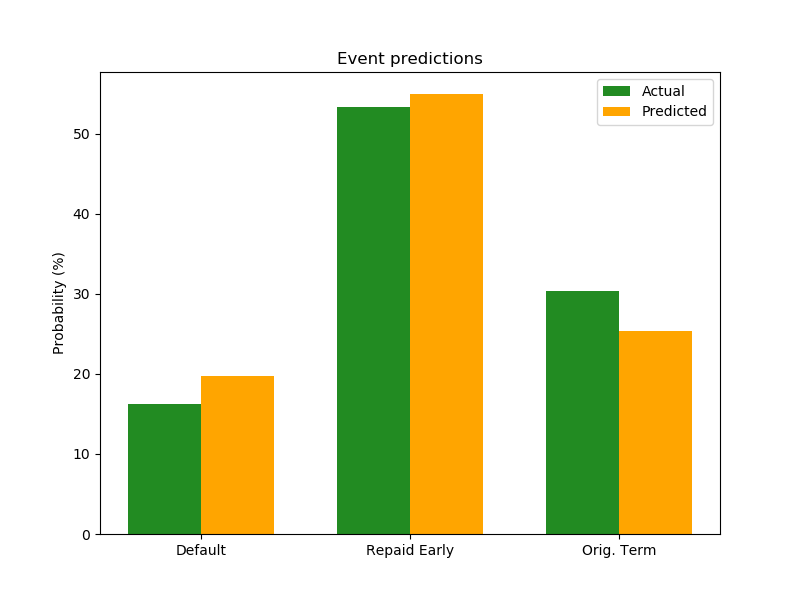

# Early repayment in personal loan markets
Using feed forward neural nets (in PyTorch) to study early repayment, default, and timing (of early repayment or default).  

Investors in fixed income securities (like p2p lending) must account for the possibility of default. This is made easier by credit ratings. However, early debt repayment can also hurt investors by altering their expected cash flow streams and leaving them with excess liquidity. This is especially a problem for those who do not have automated reinvestment strategies.

The map shows a ratio of the rate of early repayment over the rate of default for 2017-18. Ratio actually understates the rate of early repayment because there is an adjustment to avoid division by zero errors. As macroeconomic conditions change, we anticipate early repayment and default rates to move in opposite directions.

We expect higher default rates for loans with poorer credit ratings. As for the timing of default, we expect lower rated debt to default earlier (all else equal). As long as default rates are in line with what investors expect, there is not much cause for concern. Investors are hurt only if default rates exceed expected levels by a significant margin.

I am more interested in studying early repayment than defaul. Unlike default, early repayment is always a rational and strategic decision, one that requires cognitive effort and self-control. The decision also displays optimism and confidence, especially if there is a lot of time left on the clock. Of course, one could run a multivariate regression to jointly predict the likelihood repayment or default and the respective conditional likelihoods for the timeline.

## Predictions from neural net
Overall predictions (means)

Predicted early repayment timeline (number of payments)

Predicted default timeline (number of payments)

## So who is repaying earlier than expected and is this really a problem?

On average, just about everyone! Most loans -- that are repaid -- are paid off much before the maturity date.

Some data from a peer to peer lending site (Lending Club). Starting with the average loan amount by credit grade (the following are for loans that were actually repaid).

    >>>df.filter(df.term2==60).filter(df.loan_status==0).groupBy(df.grade).agg(F.mean(df.loan_amnt)).sort(df.grade).show()
    +-----+------------------+                                                      
    |grade|    avg(loan_amnt)|
    +-----+------------------+
    |    A|17904.845276872966|
    |    B|20331.642156862745|
    |    C| 19862.38723108952|
    |    D|21079.974663808225|
    |    E|22537.631738954195|
    |    F|22071.177722596665|
    |    G|23593.793103448275|
    +-----+------------------+

and the average installment (on 60 month) by the credit grade..

    >>> df.filter(df.term2==60).filter(df.loan_status==0).groupBy(df.grade).agg(F.mean(df.installment)).sort(df.grade).show()
    +-----+------------------+                                                      
    |grade|  avg(installment)|
    +-----+------------------+
    |    A|370.47410423452726|
    |    B| 452.7048333333333|
    |    C| 481.0489947457135|
    |    D| 544.1392360163711|
    |    E| 616.5258289420351|
    |    F| 629.8699680737872|
    |    G| 695.2376379310348|
    +-----+------------------+

taking the ratio provides the number of installments that must be received for investors to break even.

    >>>df.filter(df.term2==60).filter(df.loan_status==0).groupBy(df.grade).agg(F.mean(df.loan_amnt)/F.mean(df.installment)).sort(df.grade).show()
    +-----+------------------------------------------------+                        
    |grade|(avg(loan_amnt) / avg(installment)              |
    +-----+------------------------------------------------+
    |    A|                               48.32954603903535|
    |    B|                               44.91147577806454|
    |    C|                               41.28973856725123|
    |    D|                               38.74003796920464|
    |    E|                              36.555859756320366|
    |    F|                               35.04084785958727|
    |    G|                               33.93630007382986|
    +-----+------------------------------------------------+

From the plot we can see that loans are being repaid faster than the breakeven period. So investors do not earn the interest rates they hope to.

In the plots, for loans with longer maturity, it appears that those with poorer credit ratings (at least at time of issuance) are paying off their a lot earlier than those with better credit ratings. This is not surprising, as their loans are much more expensive (higher interest rates).

## Regression analysis

Regression analysis reveals that the credit grade by itself is not statistically or even economically significant in terms of repayment timeline. What drives the results is the interest rate. The following estimates are from a regression analysis of 60 month loans that were repaid.

* A 1 percentage point increase in the interest rate can move the repayment ahead by 1 month (from the average repayment period of 32 months). 
* Regression analysis also reveals that those who own their homes pay off their loans about 2 months before those who rent. Those with a mortgage take a couple of weeks longer than home owners.
* A 10 percentage point increase in a borrower's debt to income ratio is associated with a delay of 2 months (from the average of 32 payments).
* Each additional $50 in monthly installments is associated with a week's additional time in repaying the loan.
* After accounting for other factors, variations in annual income or employment length do not have much impact on the repayment timeline. 
* Those who provide no additional description for their loan (apart from a broad label like 'debt consolidation' repay their loans about a month earlier than those who provide detailed descriptions. From the public data set, it is not possible to measure if this has any impact on initial loan approval decisions

Data from Lending Club: About 183,000 loans in this sample.
## Files
* DataDl.sh Bash script to download data. The first line should be removed either manually, or awk "NR!=1" file > outfile etc.. The rejectstats files are not really informative.
* Straightforward ETL and regression done using pySpark/SparkSQL (on a single source csv file, not aggregated data). sprkLCprePay.py for default and repayment stats for the plot, and repayRegs.py for the regressions. barplot.py for the bar plots and pdDefRate.csv (plot data). 
* Example data prep for NN in prepDataforNN.py The Feed Forward Neural Net using pyTorch in modelLendNN.py
